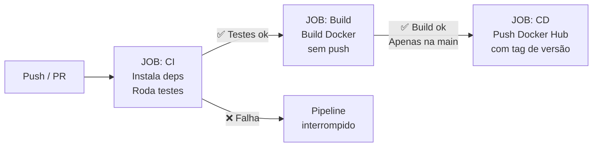

# 📋 API de Tarefas — CI/CD com Docker

Projeto desenvolvido para a disciplina de **Gerenciamento de Configuração de Software** do curso de Análise e Desenvolvimento de Sistemas.

## 👥 Equipe

| Membro | Responsabilidade |
|--------|-----------------|
| Daniel (Líder) | Repositório, pipeline CI/CD e coordenação |
| Membro 2 | Endpoints GET e POST da API |
| Membro 3 | Endpoints PUT e DELETE da API |
| Membro 4 | Dockerfile multi-stage e docker-compose |
| Membro 5 | Testes automatizados |
| Membro 6 | Documentação e README |
| Membro 7 | QA, Docker Hub e entrega |

---

## 🚀 Sobre o projeto

API REST de lista de tarefas (To-Do) com pipeline CI/CD completo utilizando **GitHub Actions** e **Docker**.

### Endpoints disponíveis

| Método | Rota | Descrição |
|--------|------|-----------|
| GET | `/health` | Verificação de saúde da API |
| GET | `/tarefas` | Listar todas as tarefas |
| GET | `/tarefas/{id}` | Buscar tarefa por ID |
| POST | `/tarefas` | Criar nova tarefa |
| PUT | `/tarefas/{id}` | Atualizar tarefa |
| DELETE | `/tarefas/{id}` | Remover tarefa |

---

## 🔄 Pipeline CI/CD



**Fluxo:**
1. Qualquer `push` ou `pull request` dispara o job de **CI** (testes)
2. Se os testes passam, o job de **Build** valida o Dockerfile
3. Se for um push na branch `main`, o job de **CD** publica a imagem no Docker Hub

---

## 🐳 Executar localmente com Docker

**Pré-requisito:** Docker instalado

```bash
# Clonar o repositório
git clone https://github.com/danielneyo/cicd-docker-ads
cd cicd-docker-ads

# Subir a aplicação
docker-compose up --build

# A API estará disponível em:
# http://localhost:8000
# Documentação automática: http://localhost:8000/docs
```

---

## 🧪 Executar os testes

```bash
# Instalar dependências
pip install -r requirements.txt

# Rodar os testes
pytest test_main.py -v
```

Saída esperada:
```
test_main.py::test_health_check              PASSED
test_main.py::test_criar_tarefa              PASSED
test_main.py::test_buscar_tarefa_existente   PASSED
test_main.py::test_buscar_tarefa_inexistente PASSED
test_main.py::test_remover_tarefa            PASSED
test_main.py::test_atualizar_tarefa          PASSED
```

---

## 📸 Evidências do Pipeline

> *(Adicionar aqui screenshots do GitHub Actions com os 3 jobs em verde após o primeiro push na main)*

---

## 🐋 Imagem no Docker Hub

```
docker pull danielneyo/api-tarefas:latest
```
